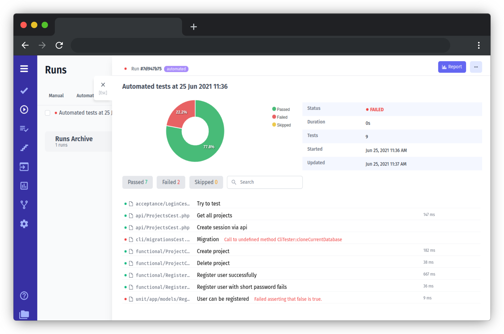
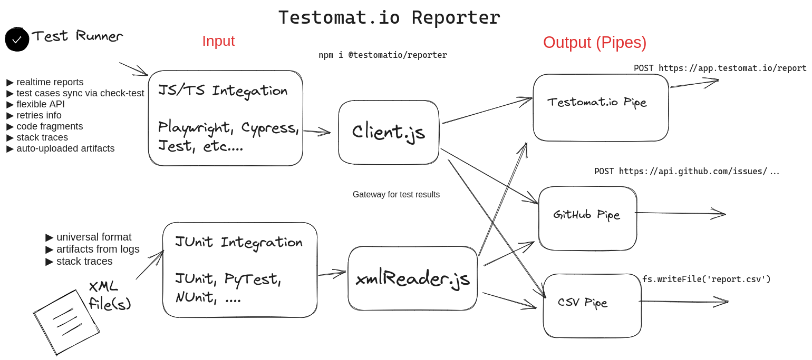
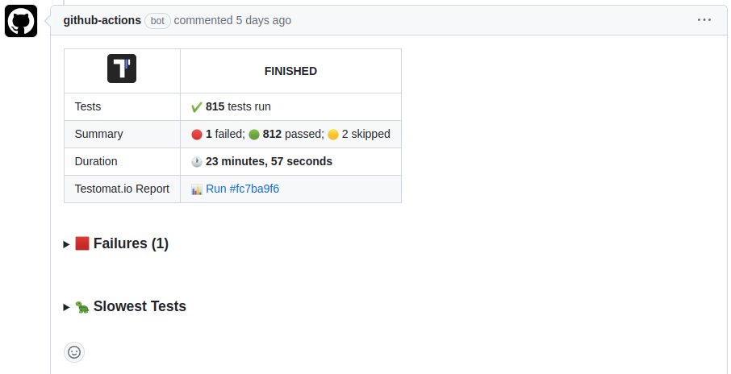
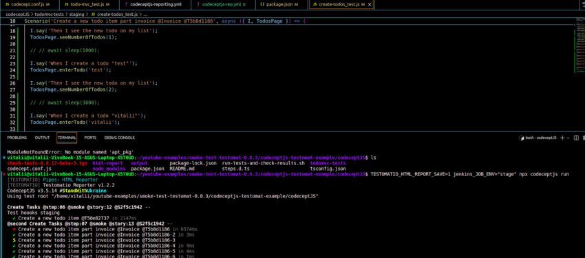

# Testomatio Reporter

👋 Hey, do you need some test reporting?

Testomat.io Reporter is a library that integrates with popular **JavaScript and TypeScript** test frameworks to provide a common interface for test reporting. By default, Testomat.io Reporter works with our reporting cloud service [Testomat.io App](https://testomat.io), however it is not locked to it. Reporter can be used as a standalone tool.

## Features

Testomat.io Reporter (this npm package) supports:

- 🏄 Integarion with all popular [JavaScript/TypeScript frameworks](./docs/frameworks.md)
- 🗄️ Screenshots, videos, traces [uploaded into S3 bucket](./docs/artifacts.md)
- 🔎 [Stack traces](./docs/stacktrace.md) and error messages
- 🐙 [GitHub](./docs/pipes/github.md) & [GitLab](./docs/pipes/gitlab.md) integration
- 🚅 Realtime reports
- 🗃️ Other test frameworks supported via [JUNit XML](./docs/junit.md)
- 🚶‍♀️ Steps _(work in progress)_
- 📄 [Logger](./docs/logger.md) _(work in progress, supports Jest for now)_
- ☁️ Custom properties and metadata _(work in progress)_
- 💯 Free & open-source.
- 📊 Public and private Run reports on cloud via [Testomat.io App](https://testomat.io) 👇



## How It Works

Testomat.io Reporter provides common API to store and organize test reports.
It can receive test result data from any [test framework](./docs/frameworks.md) and send it to different services via [pipes](./docs/pipes.md).

| 🌊 Input   | 📊 Output                                    |
| ---------- | -------------------------------------------- |
| Playwright | Report to GitHub                             |
| Cypress    | Report to GitLab                             |
| Jest       | Report to [Testomat.io](https://testomat.io) |
| ...        | ... your custom report                       |

If you use multiple test frameworks and you need to use one customizable reporter, check Testomat.io Reporter, as you can adjust it once and attach it to all your projects.



Artifacts like screenshots, videos, traces, are **uploaded to your own cloud storage** via S3 protocol. Artifacts can be uplaoded privately or publicly, and used in reports.

## Installation

To enable Testomat.io Reporter install `@testomatio/reporter` package

Use one of your favorite package managers:

```
npm install @testomatio/reporter --save-dev
```

```
pnpm install @testomatio/reporter --save-dev
```

```
yarn add @testomatio/reporter --dev
```

## Getting Started

### 1️⃣ Attach Reporter to the Test Runner

|                                                 |                                               |                                                           |
| ----------------------------------------------- | --------------------------------------------- | --------------------------------------------------------- |
| [Playwright](./docs/frameworks.md#playwright)   | [CodeceptJS](./docs/frameworks.md#CodeceptJS) | [Cypress](./docs/frameworks.md#Cypress)                   |
| [Jest](./docs/frameworks.md#Jest)               | [Mocha](./docs/frameworks.md#Mocha)           | [WebDriverIO](./docs/frameworks.md#WebDriverIO)           |
| [TestCafe](./docs/frameworks.md#TestCafe)       | [Detox](./docs/frameworks.md#Detox)           | [Codeception](https://github.com/testomatio/php-reporter) |
| [Newman (Postman)](./docs/frameworks.md#Newman) | [JUnit](./docs/junit.md#junit)                | [NUnit](./docs/junit.md#nunit)                            |
| [PyTest](./docs/junit.md#pytest)                | [PHPUnit](./docs/junit.md#phpunit)            | [Protractor](./docs/frameworks.md#protractor)             |

or **any [other via JUnit](./docs/junit.md)** report....

### 2️⃣ Configure Reports

- [Create report on Testomat.io](./docs/pipes/testomatio.md).
- [Create brief summary report for GitHub Pull Request](./docs/pipes/github.md) 👇
- [Create brief summary report for GitLab Merge Request](./docs/pipes/gitlab.md).
- [Configure other pipes](./docs/pipes/md) for other ways to process test results output.



GitHub report published as a comment to Pull Request:

### 3️⃣ Enable Artifacts Storage

1. Create bucket on AWS, Google Cloud, or any other cloud storage provider supporting S3 protocol.
2. [Pass S3 credentials](./docs/artifacts.md) to reporter to enable artifacts uploading.

### 4️⃣ Use Logger

Intercept your logger messages or log anything with our [Logger](./docs/logger.md) (_work in progress_).

### 5️⃣ TESTOMATIO HTML Report

Testomatio now features a custom reporting tool that allows you to generate a standalone HTML/CSS report for easy visualization of your test runs. This mode provides a quick way to gain a clear and visually appealing overview of your test execution.

With our reporter, you can:

- Easily analyze the results of your test runs in a convenient HTML format.

* Visualize data on successful and failed tests, including statistics and error details.
* Quickly share reports with your team members or stakeholders.



Learn more about generating HTML reports [here](./docs/pipes/html.md)

### 6️⃣ Add to CI Pipeline

After you tested reporter locally add it to your CI pipeline.

> We prepared some [example workflows](./docs/workflows.md) that might help you to get it running.

---

🎉 **You are all set!**

Bring this reporter on CI and never lose test results again!

## Documentation

- 🛠️ [Frameworks](./docs/frameworks.md)
- ⛲ [Pipes](./docs/pipes.md)
  - [Testomat.io](./docs/pipes/testomatio.md)
  - [GitHub](./docs/pipes/github.md)
  - [Gitlab](./docs/pipes/gitlab.md)
  - [CSV](./docs/pipes/csv.md)
  - [HTML report](./docs/pipes/html.md)
- 📓 [JUnit](./docs/junit.md)
- 🗄️ [Artifacts](./docs/artifacts.md)
- 🔂 [Workflows](./docs/workflows.md)
- 🖊️ [Logger](./docs/logger.md)

## Development

### REST API

Testomat.io App uses REST API to collect data from the reporter.

[👉 API Reference](https://testomatio.github.io/reporter/)

### Debug Logs

To enable verbose logging run tests with `DEBUG` environment variable:

To print all reporter logs:

```
DEBUG=@testomatio/reporter:*
```

To print all reporter logs of a specific pipe:

```
DEBUG=@testomatio/reporter:pipe:github
```
