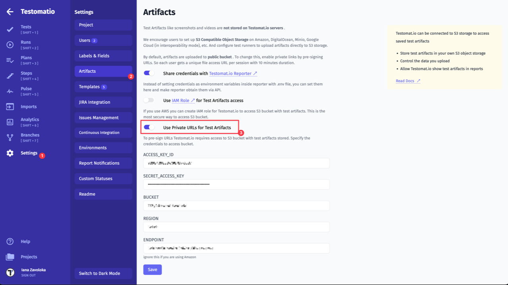
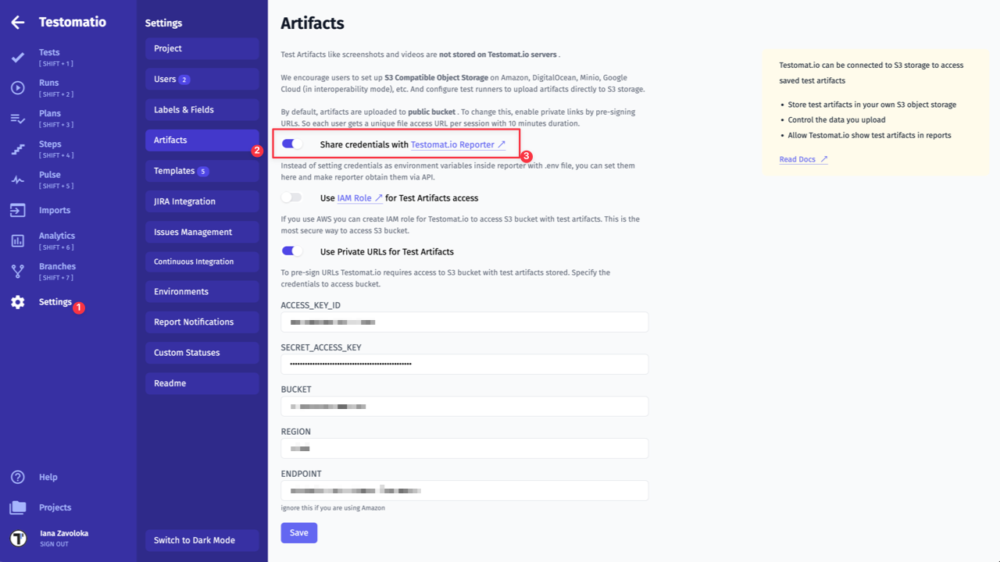
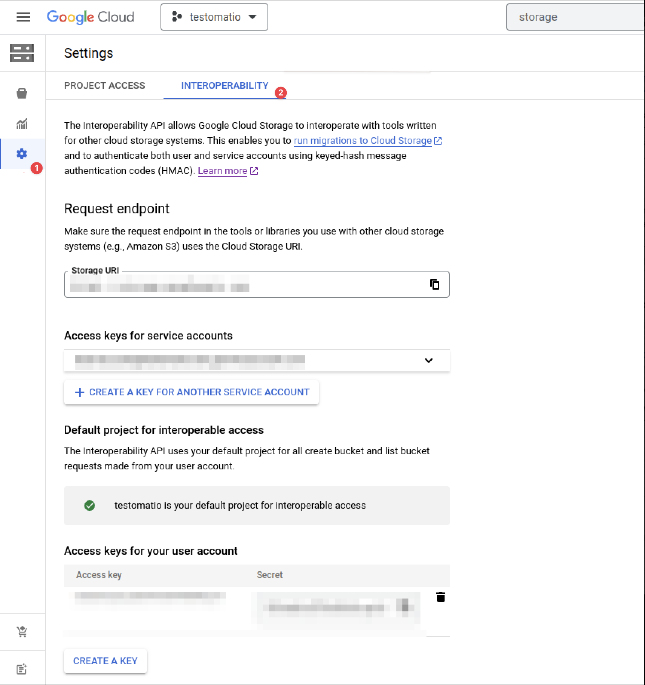

# 🛡 Test Artifacts

To inspect a failing test additional files (usually screenshots, videos or traces) can be attached to a test. These files are called test artifacts.

Testomat.io Reporter uses a custom S3 bucket for artifacts which can be obtained from any S3 provider, like AWS, DigitalOcean and others. This makes artifacts storage to be independent from Testomat.io Application. In case you decide to stop using it, you still control your data. It is also up to you to clean old artifacts when you don't need them.

By using external storage Testomat.io allows getting full control over how the storage is used. You can either clean up old test artifacts or contrary extend storage to store all history for all periods. S3 was chosen as a de-facto standard for file storage so all cloud providers support it. If you don't have S3 storage yet, you can purchase one from your favorite cloud provider and create a new bucket (storage space) on it. Testomat.io has no direct access to artifacts storage.

## Set Up S3 Bucket

To have test artifacts uploaded you need to create S3 Object Storage bucket on AWS, DigitalOcean, Azure, or Google Cloud Storage in interoperability mode.

<Aside type="caution" title="Important">

You need to obtain the following credentials: `ACCESS_KEY_ID`, `SECRET_ACCESS_KEY`, `BUCKET`, `REGION`, `ENDPOINT` (not required for AWS) to access S3 bucket. Then to to [Configuration](#configuration) section to enable S3 access.
</Aside>

## Overview

Test artifacts can be uploaded with **public (default) or private** access to a bucket


1. Reporter sends a file to S3 storage and sends link back
2. Testomat.io displays artifacts by the link in public mode or pre-signed links in private mode

> Testomat.io Application won't bill you for stored artifacts, as they are stored in your bucket. If you don't have S3 bucket yet, it's not more than 5$ a month to purchase them one of the cloud providers. S3 was chosen as it is de-facto standard for file storage for cloud hosting. All popular hosting except Microsoft Azure support S3 protocol for storing files.

If a test fails, a test runner may produce screenshot, video, or trace of a failed test. These files will be picked up by a reporter and uploaded to S3 bucket and attached to test.

## Privacy

### Public Access

**By default tests artifacts are uploaded to bucket with `public-read` permission.**

In this case uploaded files will be publicly accessible in Internet for any user via a permalink. These public links will be used by [Testomat.io Application](https://testomat.io) as well as [GitHub](./pipes/github.md#github-pipe) and [GitLab](./pipes/gitlab.md#gitlab-pipe) Pipes to display images.

A bucket can be configured to disable the public listing of files, an arbitrary user can't access a file without knowing that permalink.

Stored files will be served publicly via an appropriately configured ACL (Access Control List) or ACP (Access Control Policy).

### Private Access

If you need a more secure approach use **private access** mode. In this case, you will need to configure access credentials for Testomat.io, so it could access files inside a bucket.

First, add `TESTOMATIO_PRIVATE_ARTIFACTS=1` environment value.
Then provide the same S3 credentials in "Settings > Artifacts" section of a project, so [Testomat.io Application](https://testomat.io) could connect to the same bucket and fetch uploaded artifacts.

Links to files will be pre-signed and expire automatically in 10 minutes.



> Test Artifacts settings are available only to managers and owners of a project!

## Configuration

There are two options for setting S3 bucket credentials:

- via environment variables
- by connecting to Testomat.io Application

Recommended way is to set S3 bucket credentials as environment variables:

* `S3_ACCESS_KEY_ID` - Access key.
* `S3_SECRET_ACCESS_KEY` - Secret.
* `S3_REGION` - Region your bucket lies.
* `S3_BUCKET` - Bucket name.
* `S3_ENDPOINT` - for providers other than AWS

If you use Testomat.io Application, you can set those variables inside **Settings > Artifacts** page: enable "Share credentials" toggle to pass credentials into reporter and fill in S3 credentials into the displayed form.



In this case Testomat.io Reporter will obtain S3 credentials for server and use them to save artifacts.

Alternatively, you can configure reporter by using environment variables. If `S3_BUCKET` environment variable is defined reporter will start uploading test artifacts.

We recommend storing S3 configuration in `.env` files when running tests locally and using job configuration when running on the Continuous Integration server.
Please keep `S3_SECRET_ACCESS_KEY` in secret.

```
# enable private access mode
TESTOMATIO_PRIVATE_ARTIFACTS=1

# s3 upload config
S3_ACCESS_KEY_ID=
S3_SECRET_ACCESS_KEY=
S3_REGION=
S3_BUCKET=
S3_ENDPOINT=

```
> `S3_ENDPOINT` is required only if you use S3 provider other than AWS

To disable publishing of artifacts use `TESTOMATIO_DISABLE_ARTIFACTS=1` environment variable.

Examples of upload configuration defined in environment variables are displayed below.

## Providers

### AWS

Upload to AWS with private access mode:

```bash
TESTOMATIO_PRIVATE_ARTIFACTS=1
S3_ACCESS_KEY_ID=11111111111111111111
S3_SECRET_ACCESS_KEY=2222222222222222222222222222222222222222222
S3_BUCKET=artifacts
S3_REGION=us-west-1
```

To allow Testomat.io access stored files it is recommended to apply this policy to the bucket:

```json
{
    "Version": "2012-10-17",
    "Statement": [
        {
            "Sid": "VisualEditor0",
            "Effect": "Allow",
            "Action": [
                "s3:PutObject",
                "s3:GetObjectAcl",
                "s3:GetObject",
                "s3:GetObjectVersionAcl"
            ],
            "Resource": "arn:aws:s3:::<bucket_name>/*"
        },
        {
            "Sid": "VisualEditor1",
            "Effect": "Allow",
            "Action": [
                "s3:ListBucket",
                "s3:PutBucketCORS",
                "s3:GetBucketAcl"
            ],
            "Resource": "arn:aws:s3:::<bucket_name>"
        },
        {
            "Sid": "VisualEditor2",
            "Effect": "Allow",
            "Action": "s3:ListAllMyBuckets",
            "Resource": "*"
        }
    ]
}
```

If you use **Playwright** and you want to enable trace viewing ensure that CORS policy is enabled for the bucket:

```
aws s3api put-bucket-cors \
    --bucket YOUR_BUCKET_NAME \
    --cors-configuration '{
    "CORSRules": [
        {
            "AllowedHeaders": ["*"],
            "AllowedMethods": ["GET"],
            "AllowedOrigins": ["https://app.testomat.io"],
            "ExposeHeaders": ["Access-Control-Allow-Origin"],
            "MaxAgeSeconds": 3000
        },
        {
            "AllowedHeaders": ["*"],
            "AllowedMethods": ["GET"],
            "AllowedOrigins": ["https://trace.playwright.dev"],
            "ExposeHeaders": ["Access-Control-Allow-Origin"],
            "MaxAgeSeconds": 3000
        }
    ]
}'
```

### DigitalOcean

Upload to DigitalOcean in private access mode:

```bash
TESTOMATIO_PRIVATE_ARTIFACTS=1
S3_ENDPOINT=https://ams3.digitaloceanspaces.com
S3_ACCESS_KEY_ID=11111111111111111111
S3_SECRET_ACCESS_KEY=2222222222222222222222222222222222222222222
S3_BUCKET=artifacts
S3_REGION=ams3
```

### Minio

Upload to Minio in public access mode:

```bash
S3_ENDPOINT=http://company.storage.com
S3_ACCESS_KEY_ID=minio
S3_SECRET_ACCESS_KEY=minio123
S3_BUCKET=testomatio
S3_FORCE_PATH_STYLE=true
```

> It is important to add S3_FORCE_PATH_STYLE var for minio setup

### Google Cloud Storage

Google Cloud Storage can work via S3 protocol if **Interoperability mode** is enabled.



Open Cloud Storage. Create a bucket for artifacts, then inside Settings select "Interoperability". Create `ACCESS_KEY` and `SECRET_ACCESS_KEY` for the current user.

```bash
S3_ENDPOINT=https://storage.googleapis.com
S3_ACCESS_KEY_ID=11111111
S3_SECRET_ACCESS_KEY=2222222
S3_BUCKET=testomatio
S3_REGION=us-east1
```
Please note, that you need to enable [Use Private URLs for Test Artifacts](https://docs.testomat.io/project/runs/reporter/artifacts/#privacy) in Testomat.io Project Settings if you configure bucket credentials on Testomat.io side.

## Adding Artifacts

### JavaScript Frameworks

If you successfully configured `@testomatio/reporter` to work with the current test runner you can set up S3 credentials via environment variables.

We recommend using [dotenv](https://www.npmjs.com/package/dotenv) library in development mode to store all config variables in a file. Create .env files in the same folder where a test configuration is stored and add require('dotenv').config(); to the top of the file:

```js
// config file
require('dotenv').config()

// ...
```

Testomat.io Reporter has built-in support and automatically uploads saved artifacts for the following test frameworks:

* Playwright
* CodeceptJS
* Сypress
* WebdriverIO

If a screenshot, a video, or a trace was saved and attached to test, Testomat.io Reporter will automatically upload any of these as artifacts.

Usually, artifacts are stored automatically for failed test cases. To send arbitrary files as artifacts use [`artifact`](./functions.md#artifact) method from Testomat.io functions `@testomatio/reporter` package.

If you use other test runners or you want to add more files to test report you can add this via `@testomatio/reporter` API. To attach a file inside a test, add a filename of an existing file to `global.testomatioArtifacts` array:

```js
// inside a test:

// attach a local file to a report
global.testomatioArtifacts.push(fileName);

// attach a picture inside a test

global.testomatioArtifacts.push('img/file.png');

// attach a picture and add a name to it
global.testomatioArtifacts.push({ name: 'Screenshot', path: 'img/file.png' });
```

Artifacts will be uploaded for the current test when it is finished:

If everything was configured correctly test artifacts will be uploaded on the next run.

If S3 credentials are not set, artfact file will be ignored.

### Other Frameworks

For tests in **Java**, **Python**, **C#** and other languages, which are not (yet) integrated into Testomat.io Reporter, **use [JUnit format](./junit.md) for reporting**.

To attach a file to a test as an artifact print the file name into console with `file://` prefix and upload XML report with Testomat.io.

If S3 credentials are set, files will be uploaded to bucket and attached to test in a report.

##### Java Example:

Attaching a screenshot to the Java test

```java
// inside Java test
// assume you created a screenshot
// which is located at `pathToScreenshot`
System.out.println("file://" + pathToScreenshot);
```

##### C# Example:

Attaching a screenshot to the C# test

```c#
// assume you created a screenshot
// which is located at `pathToScreenshot`
Console.WriteLine("file://" + pathToScreenshot);
```

#### Python

Attaching a screenshot to the Python test

```python
print("file://" + pathToScreenshot)
```

#### Ruby

Attaching a screenshot to the Ruby test

```python
puts "file://" + path_to_screenshot
```

## Troubleshooting

#### I don't have a S3 Bucket

Well then, just get it. Even if your company doesn't provide one, you can purchase a S3 storage by yourself.

#### Publishing Artifacts from Docker Container

If your tests are running within Docker container pass all environment variables explicitly

```
docker run -e TESTOMATIO_PRIVATE_ARTIFACTS=1 \
-e S3_ACCESS_KEY_ID=11111111111111111111 \
-e S3_SECRET_ACCESS_KEY=2222222222222222222222222222222222222222222 \
-e S3_BUCKET=artifacts \
-e S3_REGION=us-west-1 \
run-tests
```

#### Environment variables for S3 are not working

This can be caused by various reasons. As an alternative approach, you can try to set S3 credentials inside Testomat.io Application and enable shared credentials.

#### How to cleanup old artifacts?

At this moment we don't provide any tools for the cleanup of files.
It is recommended to write a custom cleanup tool on a S3 bucket.

