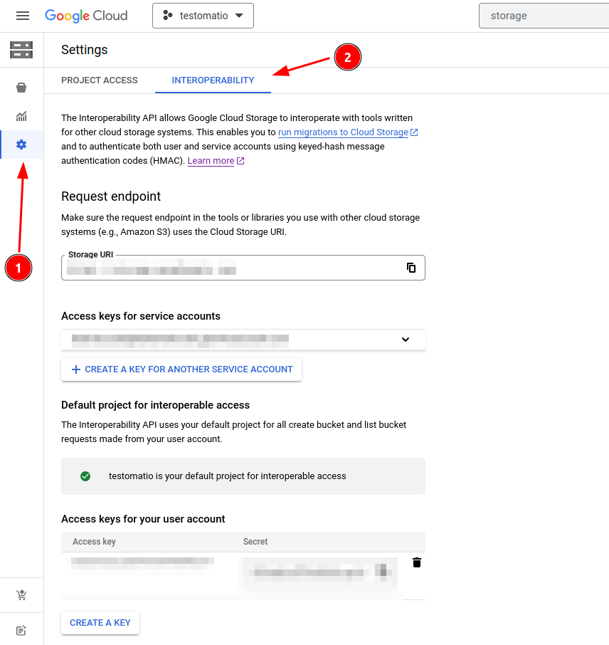

# 🛡 Artifacts

Artifacts are files produced by test runner, usually screenshots, videos or traces.

Testomat.io Reporter uses a custom S3 bucket for artifacts which can be obtained from any S3 provider, like AWS, DigitalOcean and others. This makes artifacts storage to be independent from Testomat.io Application. In case you decide to stop using it, you still control your data. It is also up to you to clean old artifacts when you don't need them.

By using external storage Testomat.io allows getting full control over how the storage is used. You can either clean up old test artifacts or contrary extend storage to store all history for all periods. S3 was chosen as a de-facto standard for file storage so all cloud providers support it. If you don't have S3 storage yet, you can purchase one from your favorite cloud provider and create a new bucket (storage space) on it. Testomat.io has no direct access to artifacts storage.


Test artifacts can be uploaded with public (default) or private access to a bucket

1. reporter sends a file to S3 storage and sends link back
2. Testomat.io displays artifacts by the link in public mode or pre-signed links in private mode

> **Note**
> Testomat.io Application won't bill you for stored artifacts, as they are stored in your bucket. If you don't have S3 bucket yet, it's not more than 5$ a month to purchase them one of the cloud providers. S3 was chosen as it is de-facto standard for file storage for cloud hosting. All popular hosting except Microsoft Azure support S3 protocol for storing files.

If a test files, a test runner may produce screenshot, video, or trace of a failed test. These files will be picked up by a reporter and uploaded to S3 bucket and attached to test.

### Configuration

There are two options for setting S3 bucket credentials:

- via environment variables
- by connecting to Testomat.io Application

Recommended way is to set S3 bucket credentials as environment variables:

- **S3_REGION** - Region your bucket lies.
- **S3_BUCKET** - Bucket name.
- **S3_ACCESS_KEY_ID** - Access key.
- **S3_SECRET_ACCESS_KEY** - Secret.
- **S3_ENDPOINT** - for providers other than AWS

These variables can be stored into `.env` file if tests are executed locally or added to CI configuration. Please keep `S3_SECRET_ACCESS_KEY` in secret.

If you use Testomat.io Application, you can set those variables inside **Settings > Artifacts** and share credentials with reporter


In this case Testomat.io Reporter will obtain S3 credentials for server and use them to save artifacts.

### Privacy

**👀 By default tests artifacts are uploaded to bucket with `public-read` permission.**

In this case uploaded files will be publicly accessible in Internet. These public links will be used by [Testomat.io Application](https://testomat.io) as well as [GitHub](./pipes.md#github-pipe) and [GitLab](./pipes.md#gitlab-pipe) Pipes to display images.

**➿ To upload files with private access** bucket add `TESTOMATIO_PRIVATE_ARTIFACTS=1` environment value.
Then update provide the same S3 credentials in "Settings > Artifacts" section of a project,
so [Testomat.io Application](https://testomat.io) could connect to the same bucket and fetch uploaded artifacts.

Links to files will be pre-signed and expire automatically in 10 minutes.

### Providers

##### AWS

```bash
TESTOMATIO_PRIVATE_ARTIFACTS=1
S3_ACCESS_KEY_ID=11111111111111111111
S3_SECRET_ACCESS_KEY=2222222222222222222222222222222222222222222
S3_BUCKET=artifacts
S3_REGION=us-west-1
```

##### DigitalOcean

```bash
TESTOMATIO_PRIVATE_ARTIFACTS=1
S3_ENDPOINT=https://ams3.digitaloceanspaces.com
S3_ACCESS_KEY_ID=11111111111111111111
S3_SECRET_ACCESS_KEY=2222222222222222222222222222222222222222222
S3_BUCKET=artifacts
S3_REGION=ams3
```

##### Minio

```bash
S3_ENDPOINT=http://company.storage.com
S3_ACCESS_KEY_ID=minio
S3_SECRET_ACCESS_KEY=minio123
S3_BUCKET=testomatio
S3_FORCE_PATH_STYLE=true
```

> It is important to add S3_FORCE_PATH_STYLE var for minio setup

##### Google Cloud Storage

Google Cloud Storage can work via S3 protocol if **Interoperability mode** is enabled.



Open Cloud Storage. Create a bucket for artifacts, then inside Settings select "Interoperability". Create Access Key and Secret Key for the current user.

```bash
S3_ENDPOINT=https://storage.googleapis.com
S3_ACCESS_KEY_ID=11111111
S3_SECRET_ACCESS_KEY=2222222
S3_BUCKET=testomatio
S3_REGION=us-east1
```

### Adding Artifacts

#### JavaScript Frameworks

Testomat.io Reporter has built-in support for test artifacts of following frameworks:

- Playwright
- CodeceptJS
- Cypress
- webdriverio

If a screenshot, a video, or a trace was saved and attached to test, Testomat.io reporter will automatically upload any of these as artifacts.

Usually, artifacts are stored automatically for failed test cases. To send arbitrary files as artifacts use [`artifact`](./functions.md#artifact) method from testomat functions `@testomatio/reporter` package.

If S3 credentials are not set, artfact file will be ignored.

### Other Frameworks

For tests in **Java**, **Python**, **C#** and other languages, which are not (yet) integrated into Testomat.io Reporter, **use [JUnit format](./junit) for reporting**.

To attach a file to a test as an artifact print the file name into console with `file://` prefix and upload XML report with Testomat.io.

If S3 credentials are set, files will be uploaded to bucket and attached to test in a report.

##### Java Example:

Attaching a screenshot to the Java test

```java
// inside Java test
// assume you created a screenshot
// which is located at `pathToScreenshot`
System.out.println("file://" + pathToScreenshot);
```

##### C# Example:

Attaching a screenshot to the C# test

```C#
// assume you created a screenshot
// which is located at `pathToScreenshot`
Console.WriteLine("file://" + pathToScreenshot);
```

#### Python

Attaching a screenshot to the Python test

```python
# assume you created a screenshot
# which is located at `pathToScreenshot`
print("file://" + pathToScreenshot)
```

#### Ruby

Attaching a screenshot to the Ruby test

```python
# assume you created a screenshot
# which is located at `path_to_screenshot`
puts "file://" + path_to_screenshot
```

## Troubleshooting

#### I don't have a S3 Bucket

Well then, just get it. Even if your company doesn't provide one, you can purchase a S3 storage by yourself.

#### Publishing Artifacts from Docker Container

If your tests are running within Docker container pass all environment variables explicitly

```
docker run -e TESTOMATIO_PRIVATE_ARTIFACTS=1 \
-e S3_ACCESS_KEY_ID=11111111111111111111 \
-e S3_SECRET_ACCESS_KEY=2222222222222222222222222222222222222222222 \
-e S3_BUCKET=artifacts \
-e S3_REGION=us-west-1 \
run-tests
```

#### Environment variables for S3 are not working

This can be caused by various reasons. As an alternative approach, you can try to set S3 credentials inside Testomat.io Application and enable shared credentials.

#### How to cleanup old artifacts?

At this moment we don't provide any tools for the cleanup of files.
It is recommended to write a custom cleanup tool on a S3 bucket.
