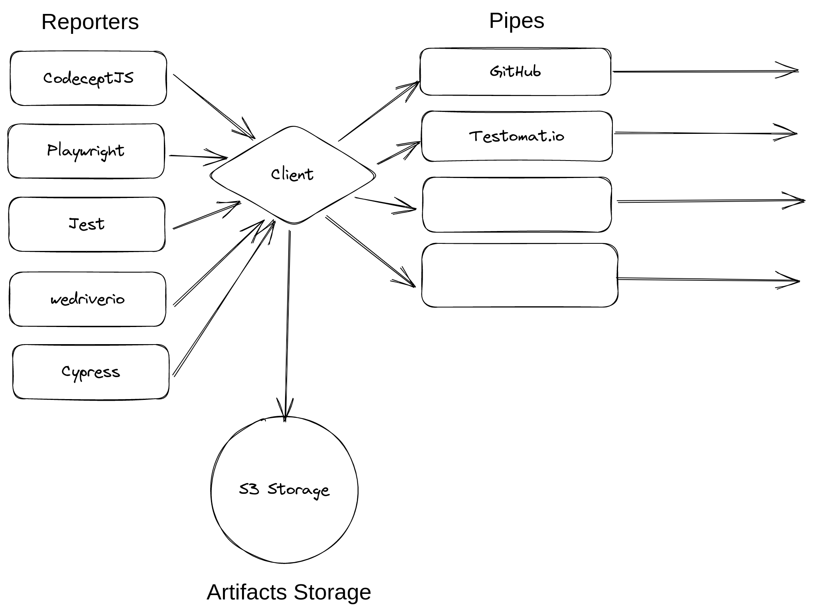

## 📯 Pipes

### What are Pipes?

Unlike other reporters, Testomat.io Reporter doesn't force you to report data only to Testomat.io application. Testomat.io Reporter collects data from test frameworks and submits it via pipes to other services.

For instance, you can enable GitHub Pipe to create a comment on a GitHub Pull Request and CSV Export Pipe to write a report in CSV format. To report data to Testomat.io App, Testomat.io Pipe should be enabled, but not required if you don't plan to use Testomat.io App. You can also write your own pipe to:

* 📈 send data to analytics storage
* 🗄 store data into database
* 📧 send emails
* 💬 send notifications to chats
* etc....

Pipes work in the very same manner for all supported test frameworks, as well as for JUnit reports. So writing a pipe instead of a custom reporter for a particular framework, saves your time as you can be sure, this pipe will work with any attached test result.

Testomat.io Reporter doesn't store test data in any internal format. Test data is processed in memory. While a test is running, all pipes are notified of changes. 

Pipes Concepts:

* **Pipes are configured via environment variables** - each test framework has its own configuration (or not). To ensure that a pipe receives its configuration it is independent from a running test framework.
* **Pipes are enabled if a corresponding environment variables are set** - for instance, if `TESTOMATIO` variable is present, Testomat.io Pipe is enabled, if `GH_PAT` variable is set, GitHub Pipe is enabled.
* **Custom Pipes** can be created as modules and added to `package.json` file.
* When used locally environment variables are expected to be set in `.env` file. When running on CI server use Environment Configuration a CI server provides to pass environment variables into the pipeline.

### Built-in Pipes

* [Testomat.io](./pipes/testomatio.md)
* [GitHub](./pipes/github.md)
* [Gitlab](./pipes/gitlab.md)
* [CSV](./pipes/csv.md)

## Custom Pipe

*to be updated*

....