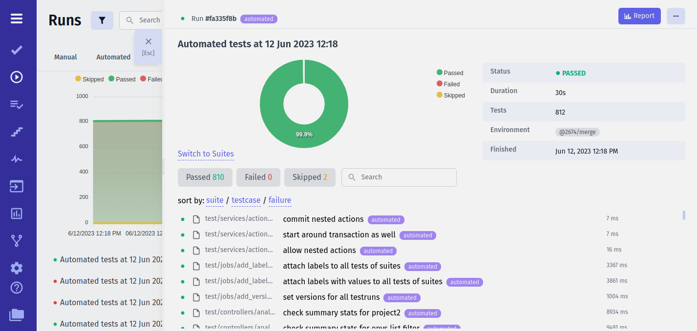

## 📯 Pipes

#### What are Pipes?

Unlike other reporters, Testomat.io Reporter doesn't force you to report data only to Testomat.io application. Testomat.io Reporter collects data from test frameworks and submits it via pipes to other services.


For instance, you can enable GitHub Pipe to create a comment on a GitHub Pull Request and CSV Export Pipe to write a report in CSV format. To report data to Testomat.io App, Testomat.io Pipe should be enabled, but not required if you don't plan to use Testomat.io App. You can also write your own pipe to:

* 📈 send data to analytics storage
* 🗄 store data into database
* 📧 send emails
* 💬 send notifications to chats
* etc....

Pipes work in the very same manner for all supported test frameworks, as well as for JUnit reports. So writing a pipe instead of a custom reporter for a particular framework, saves your time as you can be sure, this pipe will work with any attached test result.

Testomat.io Reporter doesn't store test data in any internal format. Test data is processed in memory. While a test is running, all pipes are notified of changes. 

Concepts about pipes:

* **Pipes are configured via environment variables** - each test framework has its own configuration (or not). To ensure that a pipe receives its configuration it is independent from a running test framework.
* **Pipes are enabled if a corresponding environment variables are set** - for instance, if `TESTOMATIO` variable is present, Testomat.io Pipe is enabled, if `GH_PAT` variable is set, GitHub Pipe is enabled.
* **Custom Pipes** can be created as modules and added to `package.json` file.
* When used locally environment variables are expected to be set in `.env` file. When running on CI server use Environment Configuration a CI server provides to pass environment variables into the pipeline.

## Testomat.io Pipe



Testomat.io Pipe sends data to [Testomat.io Application](https://app.testomat.io). Testomat.io provides free projects forever and unlimited test runs. Even it is a cloud application you can use it for free.

**🔌 To enable Testomat.io pipe set `TESTOMATIO` environment variable with API key provided by Testomatio.**


```
TESTOMATIO={API_KEY} <actual run command>
```

Here are some possible use cases where you can use additional configuration on reporter:

### Create Unmatched Tests

Testomat.io will not create tests from the report if they have not been previously imported. To create tests during the report `TESTOMATIO_CREATE` option can be used:

```bash
TESTOMATIO={API_KEY} TESTOMATIO_CREATE=1 <actual run command>
```

### Add Report to Run by ID

This feature is widely used when a run is executed on CI.
A run is created before the test is started and it is marked as `scheduled`. Then
a report is assigned to that run using `TESTOMATIO_RUN` environment variable and `{RUN_ID}` of a run:

```bash
TESTOMATIO={API_KEY} TESTOMATIO_RUN={RUN_ID} <actual run command>
```

### Do Not Finalize Run

If multiple reports are added to the same run, each of them should not finalize the run. 
In this case use `TESTOMATIO_PROCEED=1` environment variable, so the Run will be shown as `Running`

```
TESTOMATIO={API_KEY} TESTOMATIO_PROCEED=1 TESTOMATIO_RUN={RUN_ID} <actual run command>
```

After all reports were attached and run can be execute the following command:

```
TESTOMATIO={API_KEY} TESTOMATIO_RUN={RUN_ID} npx start-test-run --finish
```

### Setting Report Title

Give a title to your reports by passing it as environment variable to `TESTOMATIO_TITLE`.

```bash
TESTOMATIO={API_KEY} TESTOMATIO_TITLE="title for the report" <actual run command>
```

### Reporting Parallel Execution to To Same Run

Provide a shared unique title to all runs that will be running in parallel, and add `TESTOMATIO_SHARED_RUN` environment var. So all reports will be sent to this run.

```bash
TESTOMATIO={API_KEY} TESTOMATIO_TITLE="report for commit ${GIT_COMMIT}" TESTOMATIO_SHARED_RUN=1 <actual run command>
```

We recommend using a commit hash as a title to create a new Run. In this case we ensure that run title is unique and will be the same for all parallel jobs running exactly for this commit.


### Adding Report to RunGroup

Create/Add run to group by providing `TESTOMATIO_RUNGROUP_TITLE`:

```sh
TESTOMATIO={API_KEY} TESTOMATIO_RUNGROUP_TITLE="Build ${BUILD_ID}" <actual run command>
```

### Adding Environments to Run

Add environments to run by providing `TESTOMATIO_ENV` as comma seperated values:

```bash
TESTOMATIO={API_KEY} TESTOMATIO_ENV="Windows, Chrome" <actual run command>
```

## GitHub Pipe

GitHub Pipe adds a comment with a summary of a run to a Pull Request:


This summary will contain:

* Status of a test run 
* Number of failed/passed/skipped tests
* Stack traces of failing tests (first 20)
* Screenshots of failed tests (if available)
* List of 5 slowest tests

**🔌 To enable GitHub pipe set `GH_PAT` environment with GitHub Private Access Token**

When using GitHub Actions inside Pull Request you can set GH_PAT from `github.token` system variable. Here is a sample workflow:

```yaml
name: CI

on:
  push:
    branches:
    - main
  pull_request:

jobs:
  test:
  	# pre-execution steps
    - name: Run Tests
      run: <actual test command with @testomatio/reporter enabled>
      env:
        GH_PAT: ${{ github.token }}
```

### Keep Outdated Reports

If a pipeline is executed multiple times, comment with previous reports will be deleted. To keep them pass `GH_KEEP_OUTDATED_REPORTS` variable:

```yaml
    - name: Run Tests
      run: <actual test command with @testomatio/reporter enabled>
      env:
        GH_PAT: ${{ github.token }}
		GH_KEEP_OUTDATED_REPORTS: 1
```


## GitLab Pipe

## CSV Pipe

### Save test results to .csv file

Add an env to run by specifying the `TESTOMATIO_CSV_FILENAME` variable.

1) using default report name:

```bash
TESTOMATIO_CSV_FILENAME="report.csv" <actual run command>
```

2) using unique report name:

```bash
TESTOMATIO_CSV_FILENAME="test.csv" <actual run command>
```
_It's create a new /export folder with csv files_


## Custom Pipe