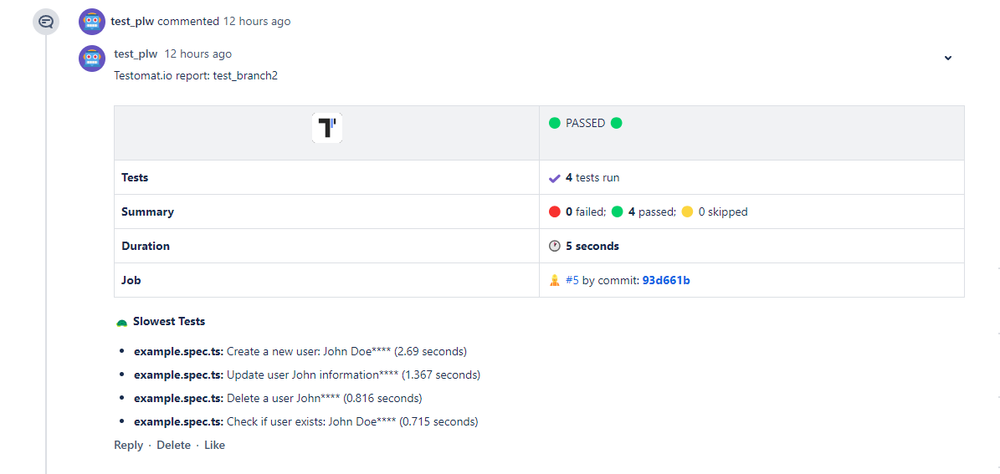
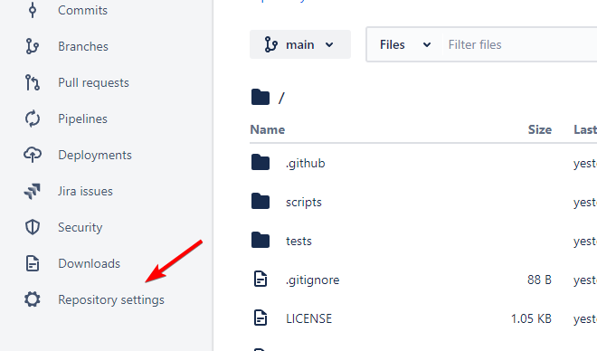
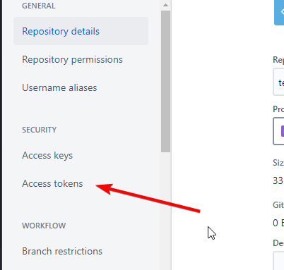
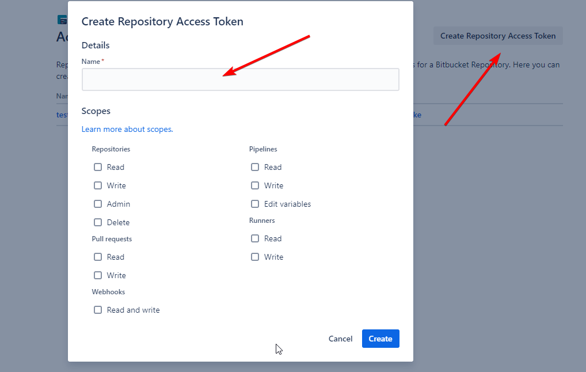
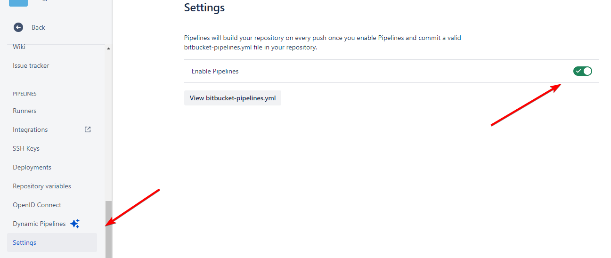
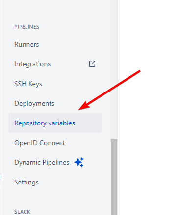
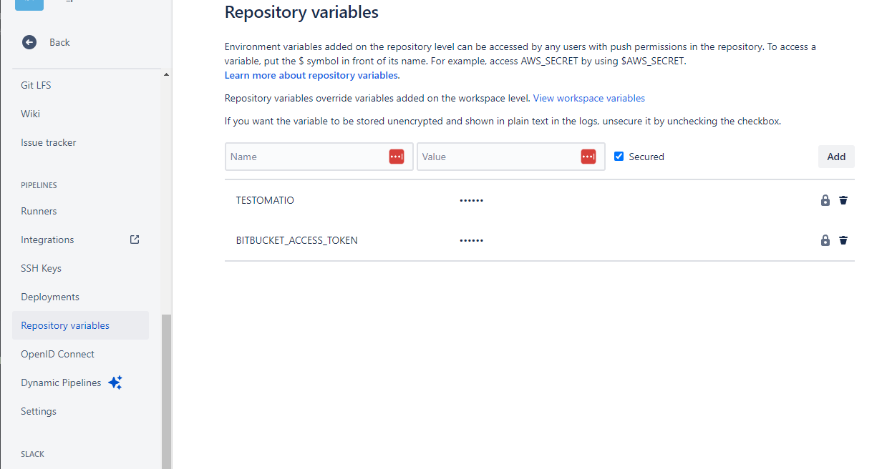

## Bitbucket Pipe

Bitbucket Pipe adds a comment with a summary of a run to a Pull Request:



This summary will contain:

- Status of a test run
- Number of failed/passed/skipped tests
- Stack traces of failing tests (first 10)
- Screenshots of failed tests (if available)
- List of 5 slowest tests

**🔌  Тo enable Bitbucket pipe set BITBUCKET_ACCESS_TOKEN in Bitbucket Repository variables**

To use the BITBUCKET_ACCESS_TOKEN from Repository Access Tokens in Bitbucket Pipelines, follow these steps:

1. In Bitbucket, go to your repository settings.

2. Select "Repository Access Tokens" under the "Access management" section.

3. Create a new Access Token, granting it the necessary permissions (e.g., read and write for the repository).


Now, you need to add this token as an environment variable in Bitbucket Pipelines:

1. Go to "Pipelines" in your repository settings.

2. Select "Repository variables" under the "Settings" section.

3. Add a new variable with the name BITBUCKET_ACCESS_TOKEN and paste the token


Once you've done that, your pipelines.yml configuration file will automatically use this token. Here's how it should look:
```yaml
image: atools/chrome-headless:java17-nodelts-latest

pipelines:
  pull-requests:
    '**':
      - step:
          name: Run Playwright tests
          script:
            - npm install
            - npx playwright install --with-deps chromium
            - BITBUCKET_ACCESS_TOKEN=$BITBUCKET_ACCESS_TOKEN TESTOMATIO=$TESTOMATIO npx playwright test
```

### Keep Outdated Reports

If a pipeline is executed multiple times, comment with previous reports will be deleted. To keep them pass `BITBUCKET_KEEP_OUTDATED_REPORTS` variable:

```yaml
          script:
            - npm install
            - npx playwright install --with-deps chromium
            - BITBUCKET_KEEP_OUTDATED_REPORTS=1 BITBUCKET_ACCESS_TOKEN=$BITBUCKET_ACCESS_TOKEN TESTOMATIO=$TESTOMATIO npx playwright test
```

