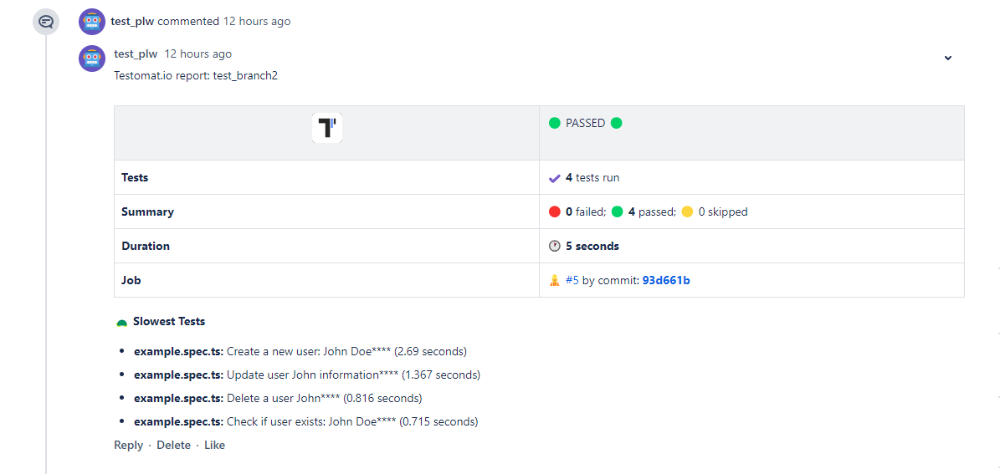
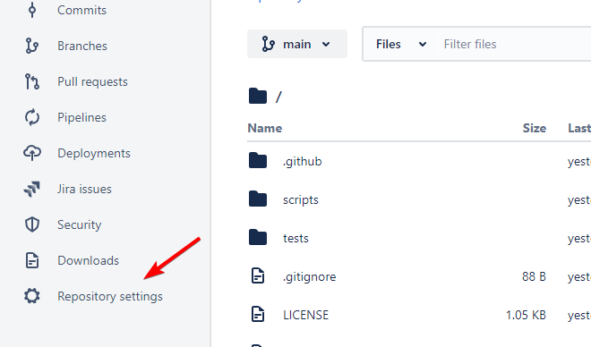
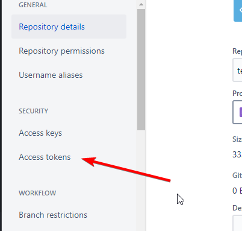
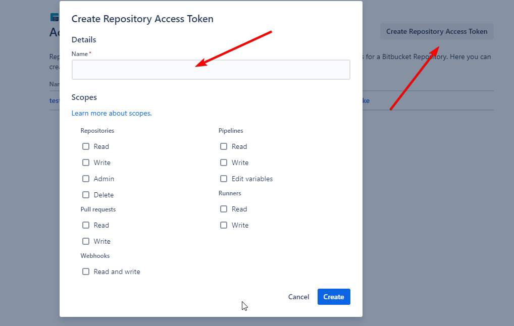
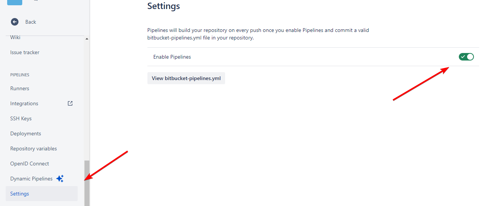
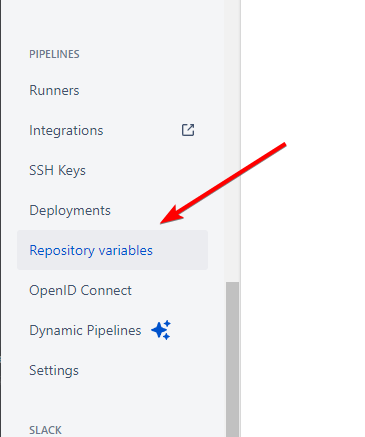
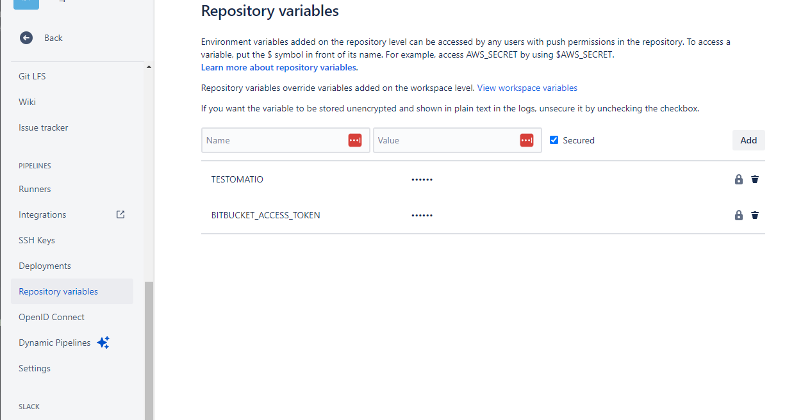

## Bitbucket Pipe

Bitbucket Pipe adds a comment with a summary of a run to a Pull Request:



This summary contains:

- Status of a test run
- Number of failed/passed/skipped tests
- Stack traces of failing tests (first 10)
- Screenshots of failed tests (if available)
- List of 5 slowest tests

**To enable Bitbucket pipe set `BITBUCKET_ACCESS_TOKEN` in Bitbucket Repository variables**

To use `BITBUCKET_ACCESS_TOKEN` in Bitbucket Pipelines, create a Repository Access Token and store it as a repository variable:

1. In Bitbucket, go to your repository settings.

   

2. Select "Repository Access Tokens" under the "Access management" section.

   

3. Create a new Access Token with the minimum permissions required to manage PR comments:

   - Pull requests: `Write`
   - Repository: `Read`

   `Pull requests: Write` is required because the reporter reads existing comments, deletes outdated Testomat comments, and posts a new one. `Repository: Read` is recommended so pipeline repository context remains accessible.

   

If your workspace policies do not allow Repository Access Tokens, use an App Password or OAuth token with equivalent permissions. Repository Access Token is the recommended and simplest option for Bitbucket Pipelines.

Now, add this token as an environment variable in Bitbucket Pipelines:

1. Go to "Pipelines" in your repository settings.

   

2. Select "Repository variables" under the "Settings" section.

   

3. Add a new variable with the name `BITBUCKET_ACCESS_TOKEN` and paste the token.

   

Once you've done that, your `bitbucket-pipelines.yml` configuration file can use this token. Here's how it should look:

```yaml
image: atools/chrome-headless:java17-nodelts-latest

pipelines:
  pull-requests:
    '**':
      - step:
          name: Run Playwright tests
          script:
            - npm install
            - npx playwright install --with-deps chromium
            - BITBUCKET_ACCESS_TOKEN=$BITBUCKET_ACCESS_TOKEN TESTOMATIO=$TESTOMATIO npx playwright test
```

### Requirements and Caveats

- PR comments are created only in `pull-requests` pipelines. The reporter needs `BITBUCKET_PR_ID`, which is not available in regular `branches` pipelines.
- If you see a request URL like `/pullrequests//comments`, `BITBUCKET_PR_ID` is missing and the pipeline was not started as a PR pipeline.
- Repository variables may be unavailable to pipelines from forks or restricted by workspace/repository security settings.
- Branch restrictions can still prevent pipeline execution or variable exposure even if the token itself has the correct permissions.
- If comment creation fails with `Forbidden`, verify both token scopes and whether the pipeline actually runs in the target repository context.

### Keep Outdated Reports

If a pipeline is executed multiple times, the previous report comment is deleted. To keep older comments, pass `BITBUCKET_KEEP_OUTDATED_REPORTS`:

```yaml
script:
  - npm install
  - npx playwright install --with-deps chromium
  - BITBUCKET_KEEP_OUTDATED_REPORTS=1 BITBUCKET_ACCESS_TOKEN=$BITBUCKET_ACCESS_TOKEN TESTOMATIO=$TESTOMATIO npx playwright test
```
