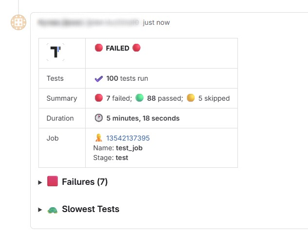

## GitLab Pipe

Similarly to [GitHub Pipe](./github.md#github-pipe), GitLab Pipe adds a comment with a summary of a run to a Merge Request:



This summary contains:

- Status of a test run
- Number of failed, passed, and skipped tests
- Stack traces of failing tests (first 20)
- Screenshots of failed tests (if available)
- List of 5 slowest tests

**To enable GitLab pipe set `GITLAB_PAT` environment with a GitLab access token.**

### GitLab Token Requirements

Use either a Personal Access Token or a Project Access Token with `api` scope.

In GitLab CI/CD variables, make sure:

- `GITLAB_PAT` is available in pipelines where Merge Requests are executed
- The variable is not restricted only to protected branches if your Merge Request pipelines run on unprotected branches

### `.gitlab-ci.yml` Example

Use Merge Request pipelines, as GitLab pipe requires MR context (`CI_MERGE_REQUEST_IID` and `CI_PROJECT_ID`).

```yaml
stages:
  - test

tests:
  stage: test
  image: node:20
  rules:
    - if: '$CI_PIPELINE_SOURCE == "merge_request_event"'
  script:
    - npm ci
    - npx playwright install --with-deps chromium
    - GITLAB_PAT=$GITLAB_PAT TESTOMATIO=$TESTOMATIO npx playwright test
```

### Keep Outdated Reports

By default, when the same pipeline is re-run, previous Testomat.io comment is removed.
To keep old reports, set `GITLAB_KEEP_OUTDATED_REPORTS=1`.

```yaml
script:
  - npm ci
  - GITLAB_KEEP_OUTDATED_REPORTS=1 GITLAB_PAT=$GITLAB_PAT TESTOMATIO=$TESTOMATIO npx playwright test
```

### Remove All Outdated Reports

By default, only the latest previously created Testomat.io report is removed.
To remove all previous reports from the same job, set `GITLAB_REMOVE_ALL_OUTDATED_REPORTS=1`.

```yaml
script:
  - npm ci
  - GITLAB_REMOVE_ALL_OUTDATED_REPORTS=1 GITLAB_PAT=$GITLAB_PAT TESTOMATIO=$TESTOMATIO npx playwright test
```
