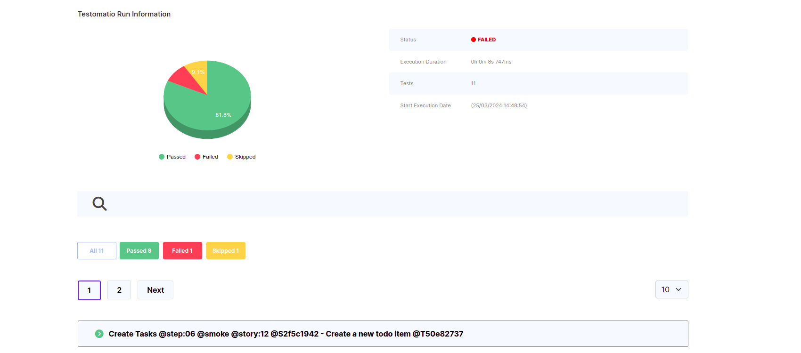

## Testomat.io HTML Pipe

The Testomat.io HTML Pipe is a feature that allows you to generate and save HTML reports based on your test results. This functionality is part of the Testomat.io testing ecosystem.

### Prerequisites

**🔌 TESTOMATIO users now have the option to generate an HTML report based on their test execution results. If a user hasn't SET `TESTOMATIO` environment, the report will still be generated**

```
TESTOMATIO_HTML_REPORT_SAVE=1 <actual run command>
```

### Enabling HTML Reports

To enable HTML reports, set the TESTOMATIO_HTML_REPORT_SAVE environment variable to 1. Additionally, you can customize the HTML report folder and filename using the following variables:

* TESTOMATIO_HTML_REPORT_SAVE=1
* TESTOMATIO_HTML_REPORT_FOLDER: Specify the folder for HTML reports
* TESTOMATIO_HTML_FILENAME: Set the desired filename for the HTML report

_!!!Please note that the name must include the extension ".html". If the extension is missing, the report will be saved with the default name = testomatio-report.html_

### Usage

The HTML Pipe operates as part of the test execution process. When running your tests with the specified environment variables, the HTML Pipe will generate reports based on the test results.

### Report Generation

Once the test run is complete, the HTML Pipe compiles the test results and generates an HTML report. The generated report is saved to the specified HTML output path.

The HTML report includes essential information, such as run ID, status, parallel execution indication, run URL, execution time, execution date, and details of individual tests.

#### Example Command

📊 Generate a report without triggering the TESTOMATIO pipe (no data sent to the client)

_Execute the following command to generate a report without sending data to TESTOMATIO:_


```
TESTOMATIO_HTML_REPORT_SAVE=1 npx codeceptjs run

```


📝 Generate a report based on the default folder/html-file name: This command triggers the test execution process and enables the HTML Pipe to generate reports based on the test results:

* Output folder: html-report/
* Output file: testomatio-report.html

_Execute the following command to generate a report with default settings:_

```
TESTOMATIO_HTML_REPORT_SAVE=1 TESTOMATIO={API_KEY} npx codeceptjs run

```


📂 Generate a report based on a custom HTML folder/html-file name.
**!!!You can SET only one of the following parameters if needed: folder or file name**

_Execute the following command to generate a report with both folder & file names:_

```
TESTOMATIO_HTML_REPORT_SAVE=1 TESTOMATIO_HTML_REPORT_FOLDER=user-html-reporter TESTOMATIO_HTML_FILENAME=custom.html TESTOMATIO={API_KEY} npx codeceptjs run

```


🖥️ An example of a report can be seen in the screenshot below:


