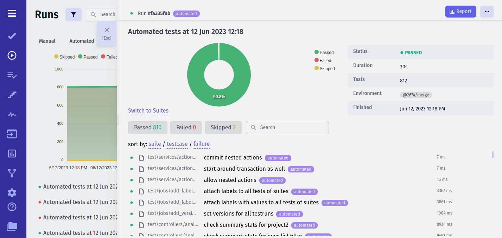
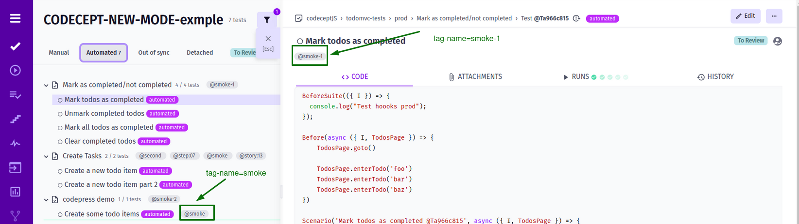
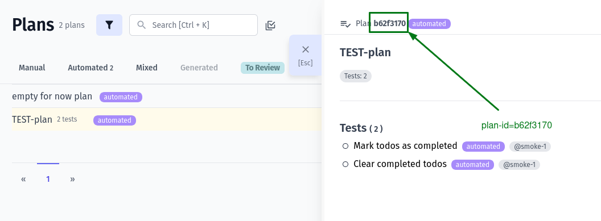
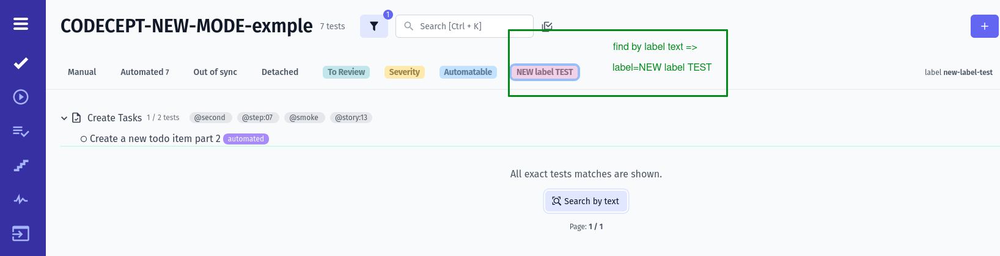
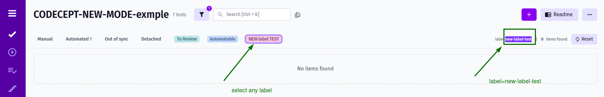
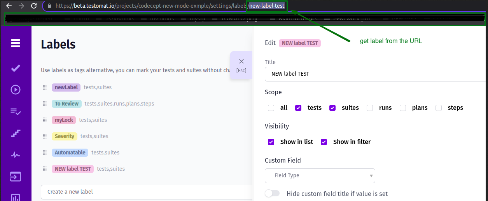
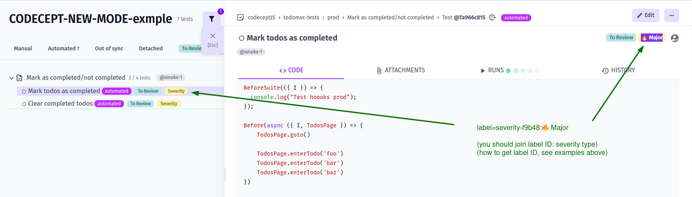
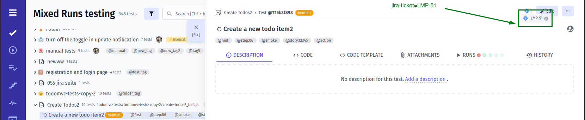

## Testomat.io Pipe



Testomat.io Pipe sends data to [Testomat.io Application](https://app.testomat.io). Testomat.io provides free projects forever and unlimited test runs. Even it is a cloud application you can use it for free.

**🔌 To enable Testomat.io pipe set `TESTOMATIO` environment variable with API key provided by Testomatio.**

```
TESTOMATIO={API_KEY} <actual run command>
```

Here are some possible use cases where you can use additional configuration on reporter:

- [Create Unmatched Tests](#create-unmatched-tests)
- [Add Report to Run by ID](#add-report-to-run-by-id)
- [Do Not Finalize Run](#do-not-finalize-run)
- [Setting Report Title](#setting-report-title)
- [Reporting Parallel Execution to To Same Run](#reporting-parallel-execution-to-to-same-run)
- [Adding Report to RunGroup](#adding-report-to-rungroup)
- [Adding Environments to Run](#adding-environments-to-run)
- [Starting an Empty Run](#starting-an-empty-run)
- [Manually Finishing Run](#manually-finishing-run)
- [Setting Build URL](#setting-build-url)
- [Publish Run](#publish-run)
- [Assign Label To Run](#assign-label-to-run)
- [Create Jira Issue for Run](#create-jira-issue-for-run)
- [Filter Tests](#filter-tests)

### Create Unmatched Tests

Testomat.io will not create tests from the report if they have not been previously imported. To create tests during the report `TESTOMATIO_CREATE` option can be used:

```bash
TESTOMATIO={API_KEY} TESTOMATIO_CREATE=1 <actual run command>
```

### Add Report to Run by ID

This feature is widely used when a run is executed on CI.
A run is created before the test is started and it is marked as `scheduled`. Then
a report is assigned to that run using `TESTOMATIO_RUN` environment variable and `{RUN_ID}` of a run:

```bash
TESTOMATIO={API_KEY} TESTOMATIO_RUN={RUN_ID} <actual run command>
```

### Do Not Finalize Run

If multiple reports are added to the same run, each of them should not finalize the run.
In this case use `TESTOMATIO_PROCEED=1` environment variable, so the Run will be shown as `Running`

```
TESTOMATIO={API_KEY} TESTOMATIO_PROCEED=1 TESTOMATIO_RUN={RUN_ID} <actual run command>
```

After all reports were attached and run can be execute the following command:

```
TESTOMATIO={API_KEY} TESTOMATIO_RUN={RUN_ID} npx @testomatio/reporter finish
```

### Setting Report Title

Give a title to your reports by passing it as environment variable to `TESTOMATIO_TITLE`.

```bash
TESTOMATIO={API_KEY} TESTOMATIO_TITLE="title for the report" <actual run command>
```

### Reporting Parallel Execution to To Same Run

Provide a shared unique title to all runs that will be running in parallel, and add `TESTOMATIO_SHARED_RUN` environment var. So all reports will be sent to this run.

```bash
TESTOMATIO={API_KEY} TESTOMATIO_TITLE="report for commit ${GIT_COMMIT}" TESTOMATIO_SHARED_RUN=1 <actual run command>
```

We recommend using a commit hash as a title to create a new Run. In this case we ensure that run title is unique and will be the same for all parallel jobs running exactly for this commit.

By default you can report to the same run if a run was created no more than 20 minutes ago. If you want to increase this time you can use `TESTOMATIO_SHARED_RUN_TIMEOUT` environment variable. `TESTOMATIO_SHARED_RUN_TIMEOUT`accepts value in minutes, so to increase timeout to 2 hours (120 minutes) use the following command:

```bash
TESTOMATIO={API_KEY} TESTOMATIO_TITLE="report for commit ${GIT_COMMIT}" TESTOMATIO_SHARED_RUN=1 TESTOMATIO_SHARED_RUN_TIMEOUT=120 <actual run command>
```

### Adding Report to RunGroup

Create/Add run to group by providing `TESTOMATIO_RUNGROUP_TITLE`:

```sh
TESTOMATIO={API_KEY} TESTOMATIO_RUNGROUP_TITLE="Build ${BUILD_ID}" <actual run command>
```

### Adding Environments to Run

Add environments to run by providing `TESTOMATIO_ENV` as comma seperated values:

```bash
TESTOMATIO={API_KEY} TESTOMATIO_ENV="Windows, Chrome" <actual run command>
```

### Starting an Empty Run

If you want to create a run and obtain its `{RUN_ID}` from [testomat.io](https://testomat.io) use the `start` command with `--format id`:

```bash
RUN_ID=$(TESTOMATIO={API_KEY} npx @testomatio/reporter start --format id)
```

`--format id` keeps `stdout` to just the run id (banner and logs go to `stderr`), so `{RUN_ID}` is captured cleanly and can be passed to other jobs in a workflow.

> When executed with `--launch` a command provided by `-c` flag is ignored

### Manually Finishing Run

If you want to finish a run started by `--launch` use `--finish` option. `TESTOMATIO_RUN` environment variable is required:

```bash
TESTOMATIO={API_KEY} TESTOMATIO_RUN={RUN_ID} npx @testomatio/reporter finish
```

### Setting Build URL

When running on CI reporter tries to detect automatically the URL of the current build. This URL will be set to Run report. Reporter automatically detects build URL for following CI services:

- GitHub Actions
- Azure Devops
- Jenkins
- CircleCi
- Gitlab CI

If you are using a different CI or you want to override build url run tests with `BUILD_URL` environment variable:

```bash
TESTOMATIO={API_KEY} BUILD_URL=<build-url> <actual run command>
```

### Publish Run

To make report publicly available pass `TESTOMATIO_PUBLISH=1` variable:

```
TESTOMATIO={API_KEY} TESTOMATIO_PUBLISH=1 <actual run command>
```

### Assign Label To Run

To assign a label to run, a **label with scope `runs` must exist**.
Then a label can be passed via `TESTOMATIO_LABEL` variable:

```
TESTOMATIO={API_KEY} TESTOMATIO_LABEL=release <actual run command>
```

There is a way to pass a value to label via `:`:

```
TESTOMATIO={API_KEY} TESTOMATIO_LABEL="module:checkout" <actual run command>
```

Or you can set multiple labels separating them with comma:

```
TESTOMATIO={API_KEY} TESTOMATIO_LABEL="release,module:checkout" <actual run command>
```

### Create Jira Issue for Run

To automatically assign Run to Jira Issue pass the ID of that issue as `TESTOMATIO_JIRA_ID` variable

```
TESTOMATIO={API_KEY} TESTOMATIO_JIRA_ID={Jira_Issue_ID} <actual run command>
```

For example, if your Jira issue id is `TST-1`, command should be:

```
TESTOMATIO={API_KEY} TESTOMATIO_JIRA_ID=TST-1 <actual run command>
```

### Filter Tests

Testomatio allows you to enhance your test execution with the option to filter and manage test runs based on various criteria. This can help you efficiently organize and execute your tests. Below, we explain how to use the `--filter` option in conjunction with Testomatio for customized test runs.

> The filtering functionality for test execution is currently available for the following frameworks: Playwright & CodeceptJS.

To use the `--filter` option with Testomatio, follow the format:

```bash
TESTOMATIO={API_KEY} npx @testomatio/reporter run <actual run command> --filter 'testomatio:{filter-type}={filter-value}'
```

#### Available Filter Types

**Tag Name Filter**

Filter tests by tag names. Use this filter to select tests associated with specific tags.



_Command execution example_

```bash
TESTOMATIO={API_KEY} npx @testomatio/reporter run 'actual run command' --filter 'testomatio:tag-name=smoke'
```

**Plan ID Filter**

Filter tests by Testomatio plan IDs. Use this filter to organize and execute tests based on plan IDs.



_Command execution example_

```bash
TESTOMATIO={API_KEY} npx @testomatio/reporter run 'actual run command' --filter 'testomatio:plan=b62f3170'
```

**Label Filter**

Filter tests using custom labels. Labels allow you to categorize tests for better management and execution.

Label Filter (by label name) Example 1:


Label Filter (by label id) Example 2:


Another Label Filter Example 3:


_Command execution example_

```bash
TESTOMATIO={API_KEY} npx @testomatio/reporter run 'actual run command' --filter 'testomatio:label=new-label-test'
```

OR

```bash
TESTOMATIO={API_KEY} npx @testomatio/reporter run 'actual run command' --filter 'testomatio:label=NEW label TEST'
```

**Label Filter based on the Severity type**

If you want to use a specific severity type, you should join the "severity" label id + severity type(e.g.: `s1-id2:⛔ Blocker`).

Here's a list of available types that you can copy and add to the run command:

- ⚠️ Critical
- ⛔ Blocker
- 🔥 Major
- 👌 Normal
- ❄️ Minor
- 💤 Trivial

Label Filter Example based on the Severity type:


_Command execution example_

```bash
TESTOMATIO={API_KEY} npx @testomatio/reporter run 'actual run command' --filter 'testomatio:label=severity-f1b11:🔥 Major'
```

OR

```bash
TESTOMATIO={API_KEY} npx @testomatio/reporter run 'actual run command' --filter 'testomatio:label=NEW label TEST:💤 Trivial'
```

**JIRA Ticket Filter**

Filter tests linked to JIRA tickets. Use this filter to coordinate testing efforts with your JIRA workflow.



_Command execution example_

```bash
TESTOMATIO={API_KEY} npx @testomatio/reporter run 'actual run command' --filter 'testomatio:jira-ticket=LMP-51'
```

**📚 Example Usage**

For instance, if you want to run tests with a specific label named "new-label-test," you can use the following command:

```bash
TESTOMATIO={API_KEY} npx @testomatio/reporter run 'npx codeceptjs run' --filter 'testomatio:label=new-label'
```

OR using Playwright:

```bash
TESTOMATIO={API_KEY} npx @testomatio/reporter run 'npx playwright test' --filter 'testomatio:label=new-label'
```

> Remember to replace {API_KEY} with your actual Testomatio API key and adjust the `<actual run command>` according to your testing setup

> It's important to note that the provided filter value must match exactly the corresponding tag name, plan ID, label, or JIRA ticket for the desired tests

Please note, that this functionality allows you to easily filter and execute tests based on specific criteria, enhancing your testing experience.

### Trigger a Remote CI Run

Instead of executing tests locally, you can ask Testomat.io to dispatch a CI workflow defined on the project. The reporter creates the run on the server, attaches the named CI profile (and any filter-resolved grep) to it, and exits — your CI is responsible for running the tests and reporting their results back into the same run.

This is useful for:

- Kicking off coverage-driven regression runs (e.g. only re-run manual or e2e tests whose source files changed in a PR) without juggling CI tokens locally.
- Running plan / tag / label-based suites from any environment without provisioning a local test runtime.
- Wiring `npx @testomatio/reporter run --remote ...` into PR comments, dashboards, or chat-ops bots.

#### Prerequisites

1. A CI profile configured on the project: in Testomat.io go to **Settings → CI**, pick a provider (GitHub Actions, GitLab CI, Jenkins, Bamboo, Bitbucket Pipelines, TeamCity, CircleCI, Azure DevOps), and save it under a name like `github`. That name is what you pass to `--remote`.
2. A project API key (`TESTOMATIO=tstmt_...`).

#### Usage

```bash
# Dispatch the `github` profile and let it run its default scope
TESTOMATIO={API_KEY} npx @testomatio/reporter run --remote github

# Dispatch + grep filter (works with every supported filter form)
TESTOMATIO={API_KEY} npx @testomatio/reporter run --remote github \
  --filter "coverage:file=coverage.manual.yml,diff=master"

TESTOMATIO={API_KEY} npx @testomatio/reporter run --remote gitlab \
  --filter "testomatio:tag-name=smoke"

TESTOMATIO={API_KEY} npx @testomatio/reporter run --remote jenkins \
  --filter "testomatio:plan=a123fb12"

# Forward extra params to the CI profile config (e.g. branch / env vars) at launch time
TESTOMATIO={API_KEY} npx @testomatio/reporter run --remote github \
  --remote-param branch=develop \
  --remote-param REGION=eu
```

Equivalent env-var form (matches the existing `TESTOMATIO_*` configuration pattern — see [Configuration](../configuration.md#testomatio_ci_profile)):

```bash
TESTOMATIO={API_KEY} \
TESTOMATIO_CI_PROFILE=github \
TESTOMATIO_CI_PARAMS="branch=develop,REGION=eu" \
  npx @testomatio/reporter run --filter "testomatio:tag-name=smoke"
```

#### How the grep is built

When a filter is set, the testomatio / coverage pipe resolves it locally to a list of test ids (e.g. `T123`, `S45`). Those ids are joined with `|` and forwarded to the CI workflow under a `grep` config key. Your CI workflow then passes that pattern to the test framework's `--grep` flag (or equivalent).

If no filter is supplied, no grep is sent and the CI workflow runs its default scope.

#### Output

On success the CLI prints the launched profile and the run URL:

```
🚀 CI build triggered on profile github
📊 Report URL: https://app.testomat.io/projects/.../runs/...
```

Then it exits `0`. The run starts in the `scheduled` state and transitions as your CI reports results back through `@testomatio/reporter` running inside the workflow.

> The CI profile name must exist on the project, otherwise the request fails with `CI launch failed: No settings for <profile>` and exits `1`. `--remote` cannot be combined with `--filter-list`.

#### Launch a Previously Prepared Run

You can separate "create the run" from "trigger CI" into two steps. First prepare a scheduled run scoped to a filter (nothing runs yet):

```bash
RUN_ID=$(TESTOMATIO_CI_PROFILE= npx @testomatio/reporter start --filter "testomatio:tag-name=smoke" --format id)
```

Later, launch that existing run on a CI profile by pointing `TESTOMATIO_RUN` at it:

```bash
TESTOMATIO_RUN=$RUN_ID npx @testomatio/reporter run --remote github
```

When `TESTOMATIO_RUN` is set, the pipe issues a `PUT /api/reporter/{runId}` with the `ci` block instead of creating a new run. With no `--filter` at launch, the pipe sends `ci: { profile, type: 'run', id: <runId> }`, asking the server to grep the run's own stored scope — so the filter from the prepare step is reused automatically. Passing a fresh `--filter` at launch overrides that scope.

### Exclude Tests from Report by Glob Pattern

To exclude tests from the report by [glob pattern](https://www.npmjs.com/package/glob) use `TESTOMATIO_EXCLUDE_FILES_FROM_REPORT_GLOB_PATTERN` environment variable:

```bash
TESTOMATIO={API_KEY} TESTOMATIO_EXCLUDE_FILES_FROM_REPORT_GLOB_PATTERN="**/*.setup.ts" <actual run command>
```

You can use multiple patterns separated by `;`:

```bash
TESTOMATIO={API_KEY} TESTOMATIO_EXCLUDE_FILES_FROM_REPORT_GLOB_PATTERN="**/*.setup.ts;tests/*.auth.js" <actual run command>
```

(Any files in `node_modules` will be ignored).
